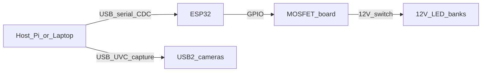

# Power, USB, and LED wiring (verified spec)

Single reference for **camera USB class**, **LED electrical assumptions**, and **how things connect**. Canonical integration behavior remains in [`station-integration.md`](station-integration.md).

---

## USB 2 vs USB 3

| | USB 2.0 High-Speed | USB 3.x SuperSpeed |
|---|-------------------|---------------------|
| **Data rate** | ~480 Mb/s theoretical (less in practice) | 5 Gb/s and up |
| **Webcams** | Typical for UVC devices; **4K often uses compression** (MJPEG / H.264) over USB 2 | Headroom for uncompressed or many simultaneous streams |
| **Connector** | Type-A or **Type-C cable does not imply USB 3** — many Type-C UVC cameras are USB 2 internally |

---

## Purchased cameras — USB class and power

| Camera | USB | Power | Notes |
|--------|-----|-------|--------|
| **ELP 4K** (see procurement in [`README.md`](README.md)) | **USB 2.0** UVC (+ HDMI 1.4 optional) | **5 V** from USB (Type-C cable on unit) | Listing / ELP docs for this line: *USB 2.0 interface*; H.264/MJPEG/YUY2. Model family often **ELP-USB4KCAM01H-CFV** (5–50 mm zoom variant) — confirm on your box. |
| **IMX323 modules** (4×, same procurement) | **USB 2.0** UVC | **5 V** bus power | Standard 1080p30 boards; MJPEG/YUY2 typical. |

**Power rule:** Cameras are **not** powered from the 24 V LED supply. They use **USB 5 V** from the host or hub, per [`station-integration.md`](station-integration.md).

**Bandwidth rule:** Do not run five continuous 4K/1080p streams on one passive USB 2 hub. Station capture is **sequential**; use a **powered USB hub** and/or **split cameras across host USB ports** (e.g. Raspberry Pi 5: use both USB-A stacks deliberately).

---

## On-site verification checklist (ELP unit)

Complete when the hardware is on the bench (tick in your own copy or issue tracker).

- [ ] **Enclosure label / quick-start** lists **USB 2.0** (or equivalent “High-Speed” / no SuperSpeed claim) if present.
- [ ] **Model / SKU** matches expected ELP 4K HDMI/USB variant from procurement link.
- [ ] On Linux: `lsusb -t` shows device under **480M** tree (USB 2), not **5000M** (USB 3).
- [ ] `v4l2-ctl --list-formats-ext` (or host tool) shows **MJPEG and/or H.264** at 4K — confirms compressed path over USB 2 is available.
- [ ] **HDMI** port behavior noted (optional path; station MVP uses **USB** capture on host).

---

## LEDs — electrical and control (from integration spec)

| Subsystem | Spec |
|-----------|------|
| **Dark-field** | **4×** white LED strips, diffusion-free mounts, grazing geometry (~5 mm above screen plane, ~10–15°, ~4 cm from device edge). See [`station-integration.md`](station-integration.md) dimension table. |
| **Bright-field** | Separate diffused top source (not the same strips in the same mounts as dark-field). |
| **Primary PSU** | **24 V / 5 A** bench supply in outer utility box. |
| **Rails** | **Buck → 12 V** for LED strips; **buck → 5 V** for ESP32 (or power ESP32 via USB from a dedicated 5 V adapter — keep **single ground reference** with MOSFET switching layout). |
| **LED product** | Assume **12 V DC** constant-voltage tape unless you explicitly buy 24 V tape — **read the reel / driver label** before wiring. |
| **Switching** | **ESP32 GPIO → MOSFET module**; **4+ channels** to allow independent bright-field vs per-side dark-field (exact channel map is a wiring detail; doc calls for a **4-channel MOSFET driver** minimum). |
| **Routing** | LED power from utility box through **light-tight pass-through** into capture shell. |

### Low-side N-channel switching (default)

- Strip **+** → fused **+12 V** bus.
- Strip **−** → MOSFET **drain**, **source** → **GND** return.
- **Gate** ← ESP32 GPIO via series resistor; use **logic-level** MOSFETs or a gate driver if `Vgs(th)` is marginal at 3.3 V.
- **Common ground:** 12 V return, ESP32 GND, and MOSFET source must share a **star or solid** ground so GPIO reference is valid.

---

## 12 V buck and MOSFET sizing (worksheet)

Fill in from **LED packaging** (W/m or total W per segment).

1. **Total LED power (12 V rail)**  
   `P_total_W = sum of all strip segments that can be ON simultaneously`  
   Example: four sides each 10 W max, all on in dark-field → **40 W**. Bright-field separate bank add `P_bf`.

2. **12 V current**  
   `I_12V_A = P_total_W / 12`  
   Add **≥25% headroom** for inrush / cold LEDs: `I_buck ≥ 1.25 × I_12V_A`.

3. **24 V input current (approx)**  
   `I_24V_A ≈ (12 × I_12V_A) / (24 × η)` with buck efficiency **η** ≈ 0.85–0.92. Must stay under **5 A** on bench PSU.

4. **Per-channel MOSFET**  
   For each channel, `I_channel` = current through that MOSFET when that bank is on. Pick **I_D(max)** and **R_DS(on)** at 3.3 V `Vgs` well above `I_channel` (e.g. 2× headroom). Prefer MOSFETs with **logic-level** rating.

5. **Record here after purchase** (edit this file or lab notebook):

| Strip SKU | V | W/m or W/segment | Length per side | I per channel @12V | Notes |
|-----------|---|------------------|-----------------|-------------------|--------|
| *(fill)* | | | | | |

---

## Signal flow (host + MCU + loads)

- **Host:** UVC capture, inference, grade display.
- **ESP32:** Light timing, door interlock, feeder, OLED; talks to host over **USB serial (CDC)**.
- **Cameras:** **USB 2** UVC only; no power from LED PSU.

---

## Related docs

- [`station-integration.md`](station-integration.md) — BOM, capture cycle, enclosure.
- [`../lighting/README.md`](../lighting/README.md) — bright-field vs dark-field optics.
